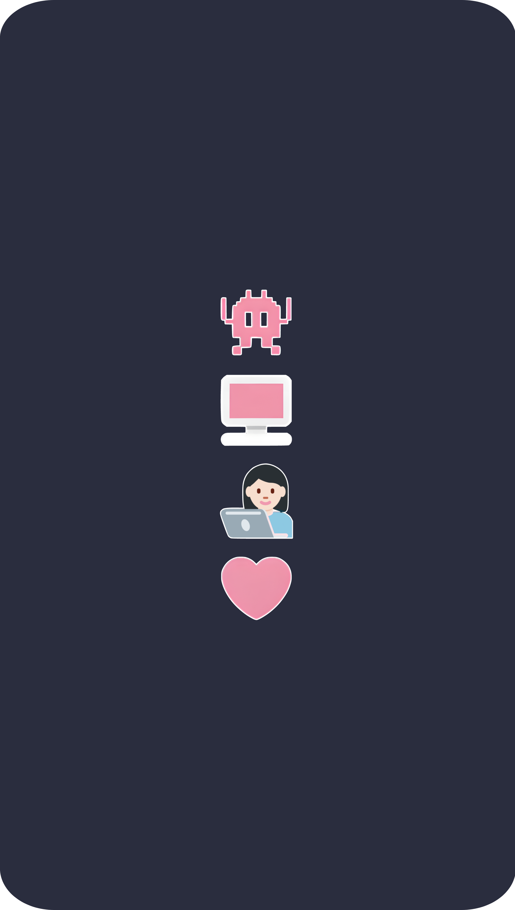

<!-- Welcome to my profile code :) -->

<!-- Hi there text -->

<!-- Side Image -->

<!-- Introduction -->

<pre>
  
  Welcome to my code space!
  
  📍 São Paulo - Brazil
  🎓 Newly graduated Systems Analyst @ UNIMONTE • IT Technician @ FORTEC
  💼 Project Governance Intern @ VIVO Telefônica • Designer Digital freelancer
  🎮 Gamer girl
   ⚒ Geology lover 💎 
<!-- Language badges -->
  &nbsp;&nbsp;&nbsp;&nbsp;&nbsp;&nbsp;  
</pre>

<!-- Banner -->

<pre>

</pre>

<!-- Hyperlinks -->

  

